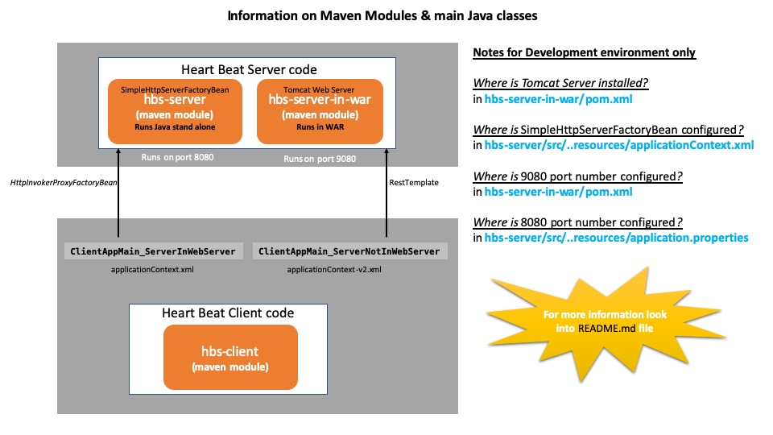

# About this Heart Beat Solution

This code base is developed to support two scenarios

** Scenario 1: ** A Java application deployed as stand-alone (i.e. non-web) but require Heart Beat Spring Bean to act as a Web Service

** Scenario 2: ** A Java application deployed in a web-server like Tomcat and Heart Beat Spring Bean should still act as a Web Service

To achieve scenario 1, i.e. Spring Bean acting as a web service, Spring documentation mention to use "SimpleHttpServerFactoryBean" class in applicationContext.xml file

To achieve scenario 2, i.e. Spring Bean acting as a web service, Spring documentation mention to use "@Controller" annotation for the Spring Bean class 

 

# Running Heart Beat Server:

** Note: Below steps assume you are invoking below commands from "hbs-main" folder **

##### 1. Not deployed in any webserver 		- as stand alone Spring / Java application

	./bin/run_server_nonweb.sh

##### 2. Deployed in web container				- as Spring / Java in WebServer (Tomcat)

	./bin/run_server_in_web.sh

# Running Heart Beat Client:

##### 1. Client invoking Server when Server is deployed as stand alone Spring / Java application

	./bin/run_client_with_server_nonweb.sh

##### 2. Deployed in web container				- as Spring / Java in WebServer (Tomcat)

	./bin/run_client_with_server_in_web.sh

